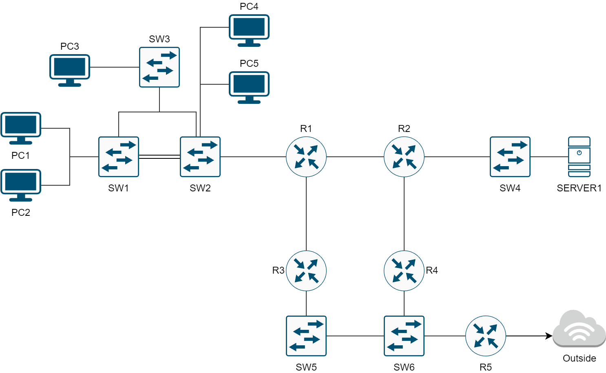
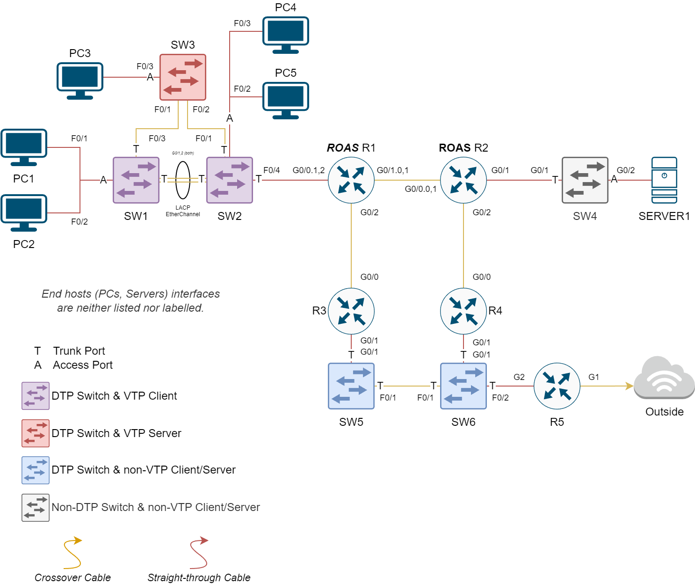
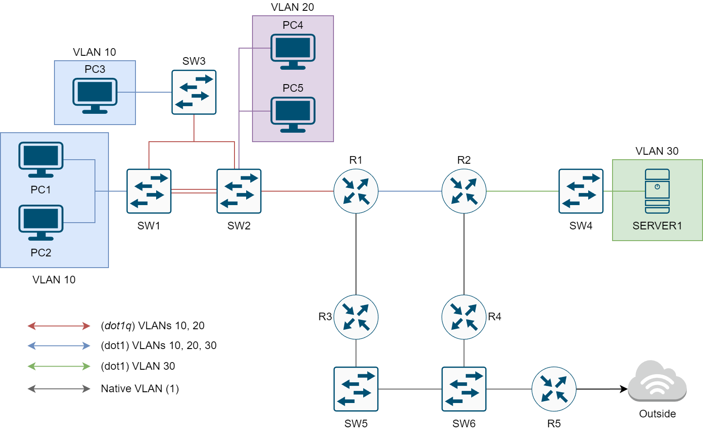
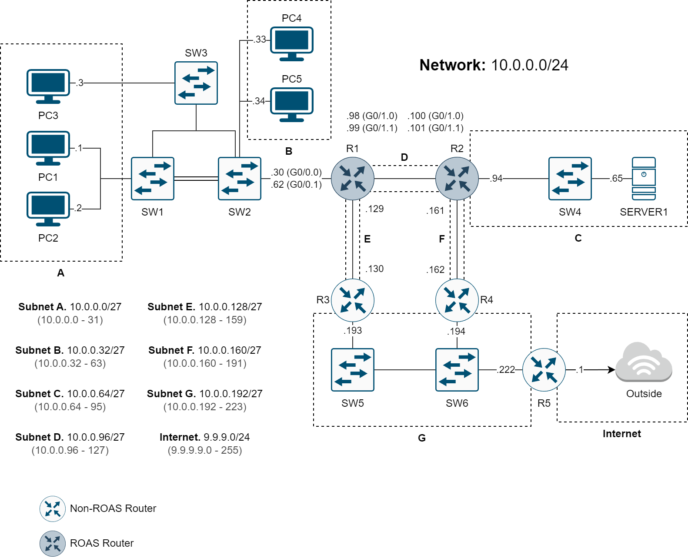
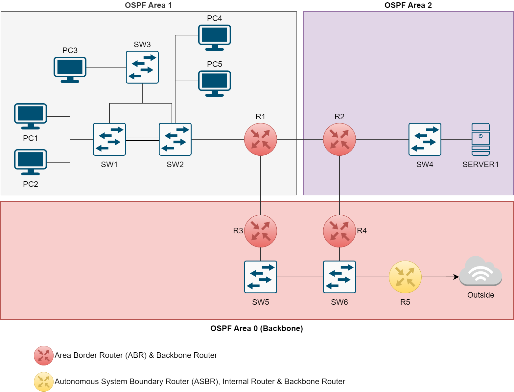

# Topology (1)

Source files (`.drawio`, `.pkt`) can be found in `./src`.

Includes some OSPF Areas and a couple of VLANs. Didn't finish up patching routers configurations though.

## Base Network Architecture

## Layer 1-2

### VLANs

## Layer 3

### OSPF Areas

